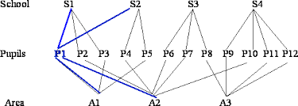
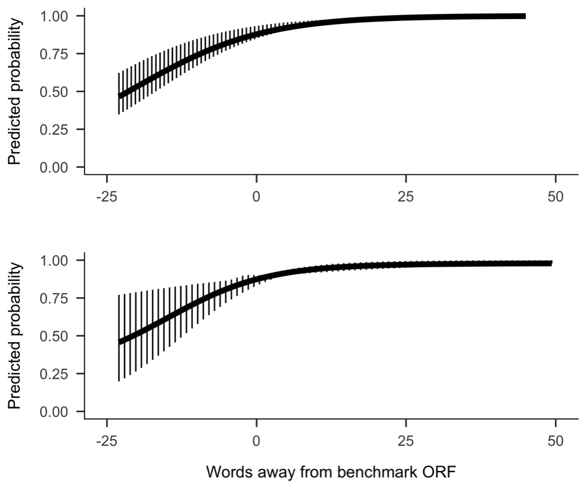

class: inverse, center, middle

# Introduction
---
## Reading Problems
```{r out.width= "650px", echo = F}
knitr::include_graphics("urban.png")
knitr::include_graphics("suburban.png")
```

???
Difference in reading outcomes for Urban and Suburban students in 4th grade, notice the gap, one way proposed to solve reading problems is RTI

---
## Response to Intervention


```{r out.width= "500px", echo = F}
knitr::include_graphics("RTI_pyramid.jpg")
```

--

-Teacher impact

-Class size

-Cohorts

???
Possible influences of these factors lead to the following research questions

---
#Research Questions

What is the probability of reading at or above benchmark in Grade 3 for students attending schools with RTI in place for three years?

What are the relations between the probability of reading at or above benchmark in Grade 3 and teachers’ experience in RTI?

What are the relations between the probability of reading at or above benchmark in Grade 3 and class size?

Do the probability and relations change for students in consecutive cohorts?

---
class: inverse, center, middle

# Methods


---
# Cross-classified Logistic Regression
```{r out.width= "500px", echo = F}

```
--

### Why?

Students are nested within teachers in 3 grade levels: Grade 1, Grade, and Grade 3.
A group of students does not necessarily move intact through the grades.


Binary outcome for reading at or above the cut-off score for reading disabitlies
???

instead of the area and school in the graph, think teacher grade 1, teacher grade 2, etc.
---
##Data 

Data: a **state-funded project** to implement RTI frameworks in several **high-priority elementary schools** in a northeastern state.

Cohort 1: G1 2012 to G3 2014 

Cohort 2: G1 2013 to G3 2015

--
## Variables
Outcome: Reading at Cut-off on **WRMT Passage Comprehension** in 3rd grade. *0 = below 30th %ile. 1 = at or above 30th %ile*

Predictors: 
1. **ORF** scores in Winter first grade; centered at benchmark (i.e., *23 WCPM*).
2. Teacher **Experience** with the project (i.e., *0 = started in 2012, 1 = started in 2012 ... etc.).
3. Teacher **class size**; centered at the *grand mean*.

???
Used cohort 1 for model building and cohort 2 for verification
---
class: inverse, center, middle

# Results Cohort 1
---
###Unconditional Model
$$\log(\frac{\pi_i}{1-\pi_i})=\beta_0 + \upsilon^{(4)}_{G3(i)} +\upsilon^{(3)}_{G2(i)}+\upsilon^{(2)}_{G1(i)}$$ and
$$\upsilon^{(z)}_{Gz(i)} \sim N(0, \sigma^2_{\upsilon(z)})$$ 
###ICC 
$$VarC_{j} =\frac{\upsilon^{(2)}_{j}}{({\upsilon^{(2)}_{j}+\upsilon^{(3)}_{l}+\upsilon^{(4)}_{k}+{\frac{\pi^2}3}})},$$ where $\frac{\pi^2}{3}$ is the variance at the student level.

???
where $\pi_i$ is the probability of reading at the cut-off in Grade 3 (i.e., probability of $y_i=1$), $\upsilon^{(4)}_{G3(i)}$ is the random effect of Grade 3 teachers, $\upsilon^{(3)}_{G2(i)}$ is the random effect of Grade 2 teachers, and $\upsilon^{(2)}_{G1(i)}$ is the random effect of Grade 1 teachers.
---
###Unconditional model Outcomes
|        | M1        |     M1.3  |
|-----|-----|-----|
| Fixed effects:| |
| Intercept  | 1.115\*\*\*  | 1.825\*\*\*  |
|  Random effects |   |   |
| G1  | .044  | .044  |
| G2  |  0 |   |
|  G3 |   .438| .438  |
|   |   |   |

( $X^2_{[1]}$ = 0, p > .999)

--

###ICC
1. G1 = 1.2%
2. G2 = 0%
3. G3 = 11.6%
4. G1 + G3 = 45%


???
The results from the unconditional cross-classified model indicate that the log-odds of reading below benchmark on the WRMT PC subtest in third grade for students is 1.12 (SE=0.32, p<.001), meaning that the probability of reading at benchmark for these students is about 0.75. The between-teacher variance in the log-odds of reading on grade level in first grade was 0.04 (SD=0.21), and in third grade 0.44 (SD=0.66). The group effect for second grade was essentially 0 (X_([2])^2=〖1.96〗^(-10), SD=〖1.38〗^(-5)). The partitioning of the variance coefficients show that about 87% of the total variance is at the individual student level, 1.2% at first grade teacher level, 0% at the second grade teacher level, and 11.6% at the third grade teacher level. These values can also be interpreted as intraclass correlations. The correlation between the log-odds of two students attending the same first grade classroom, but different second and third grade classrooms is 0.01. For students that have the same third grade teacher but different first and second grade teachers, this value is 0.12. For students who received instruction from the same first and third grade teachers, this correlation is 0.45. A LR test indicated the addition of the second grade group effect did not improve model fit from an unconditional model with classifications for first and third grade only (X_([1])^2 = 0, p > .999). Therefore, I removed the second grade classification from the subsequent models.

---
###Final Model

--

$$\log(\frac{\pi_{ijk}}{1-\pi_{ijk}})= \gamma_0+ \gamma_{1 ORF_{ijk}} + \gamma_{2 EXP_j} + \gamma_{4 Classsize_j}+ \gamma_{3Classsize_j*ORF_{ijk}} + \upsilon_{0j} +\upsilon_{0k},$$
--

###Parameter estimates
|   | M4.1  |
|---|---|
| Fixed effects:  |   |
|  	Intercept | 1.761\*\*\*  |
| ORF Winter G1  | 0.095\*\*  |
| Experience G3  |  0.434 |
|  Class size G3 | 0.044  |
|  	ORF X Class size G3   |  -0.009\* |
| Random effects  |   |
| G1  |  0 |
|  	G3 |  0 |


???
After going through the model building steps in L1 (contextual effects, random slopes) and L2 (random intercepts for all predictors and crosslevel interactions) the final model is this. The results from the final model show the log-odds for reading at benchmark level for a student who read at the benchmark cut-off for ORF in winter of first grade and attended a class of average size in third grade with a teacher new to the program is 1.76 (z = 3.89 p < .001). That is, these students have a .85 probability of reading at or above benchmark on the WRMT PC subtest. For each word a student in a class of average size in third grade with a teacher who started the program in 2012 read below the benchmark cut-off is associated with a decrease of 0.10 log-odds (z = 3.02, p = .003).

---
class: inverse, center, middle

# Results Cohort 2
---
##Parameter Estimates and 95% CI

|   |  Cohort 1   |M4.1   |95% CI   | Cohort 2 | M4.1a  |95% CI |
|--|--:|--:|--:|--:|--:|--:|
|  | β	 |LL  | UL | β | LL  |  UL  |
| Intercept   |  1.76 | 0.88  | 2.65  | 4.34  |1.32   | 7.36  | 
| ORF Winter G1  |  0.10 | 0.03  | 	0.16  | 	0.18  |0.02   |  0.35 |
| Experience G3  |   0.43| -0.33  | 1.20  |  -0.70 |  -1.71 |  0.31 |
|  Class size G3 |  0.04 | -0.09	  | 0.18  |  2.97 |  -1.30	 |  7.25 |
| ORF X Class size G3  | -0.01	  |  -0.02	 |   0.00| 0.15  |  	-0.09 | 	0.39  |

	
???
After fitting the final model, no variance at the teacher level remained. The log-odds for students who read at benchmark in the winter of first grade and had a third grade teacher with 3 years of experience in the project with an average size class, was 4.34 (z = 2.81, p = .005). That is, such a student has a predicted probability of 0.99 of reading above the cutoff score on the PC subtest of WRMT. Controlling for third grade class size and teacher experience, each word a student read above the winter benchmark, increased the log-odds by 0.18 (z = 2.15, p = .032). While not statistically significant, teachers’ experience had a negative impact on the log-odds of students, with every year less a teacher spent in the program associated with a -0.70 (z = -1.35, p = .176) decrease in the log-odds. Class size had a positive effect on the log-odds for reading on gradelevel (2.97, z = 1.36, p = .173). Finally, the interaction between grade 1 ORF scores and third grade class size was not statistically significant (0.15, z = 1.20, p = .229).
					

---
class: inverse, center, middle

# Discussion
---
## Predicted Probabilities
```{r out.width= "650px", echo = F}

```

??? 
above cohort 2, below cohort 2 seemed like there was an effect, so why not?

---
#Limitations

--

1. Was cross-classification necessary?

--

2. No outcomes for second grade.

--

3. Additional nesting of teachers within 4 schools.

--

4. Outcome may not have matched intervention.

--

5. No true baseline.


---
class: center, middle

# Questions?

###willavandijk@ufl.edu

This presentation was made with the **xaringan** package in R, using the *R-ladies* theme.
